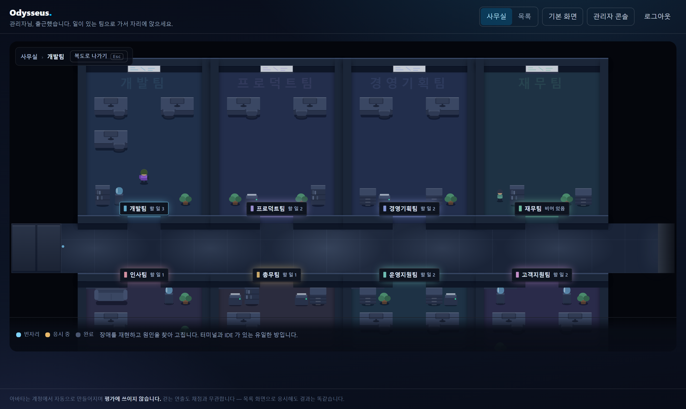

<p align="center">
  
</p>

<p align="center"><b>문제는 지문으로 주어지지 않습니다.</b></p>

<p align="center">
  Odysseus 는 실무 시뮬레이션으로 개발자를 평가합니다.<br>
  응시자는 OS 데스크톱을 닮은 시험장에 출근해, 동료와 대화하며 무엇을 해야 하는지 스스로 알아내고,<br>
  IDE·터미널·AI 에이전트로 실제 산출물을 만듭니다. 그 과정 전체가 평가입니다.
</p>

<br>

## 왜 시뮬레이션인가

코딩 테스트는 잘 정리된 문제를 줍니다. 실제 업무는 그렇지 않습니다. 요구사항은 여러 사람에게 흩어져 있고, 물어봐야 나오고, 어떤 것은 틀린 채로 전해지며, 결국 산출물로 증명해야 합니다.

Odysseus 의 시험 하나는 **상황**입니다. 출근한 첫날, 누군가의 다급한 메시지에서 시작해, 누구에게 무엇을 물어야 하는지 판단하고, 확인하고, 만들어 내는 과정을 봅니다. 채점의 중심은 요구사항을 얼마나 정확히 파악해 냈는가, 그리고 동료를 어떻게 대했는가입니다.

<br>

## 출근

응시자가 처음 보는 것은 시험 목록이 아니라 **사무실 한 층**입니다. 복도가 있고, 부서별로 방이 있고, 방 안에 자리가 있습니다. 오늘 당신에게 일이 있는 팀으로 걸어 들어가 자리에 앉으면 그 자리의 시험이 시작됩니다.

<p align="center"></p>

자리는 시험 하나입니다. 방 밖에서 누르면 그 방으로 걸어가고, 방 안에서 다시 눌러야 앉습니다 — 앉는 순간 제한 시간이 흐르기 시작하므로, 지나가다 잘못 누른 한 번으로 시험이 열리지 않게 두 번에 나눴습니다.

책상에는 글자가 없습니다. 시험 제목과 분량은 자리에 다가갔을 때 이름표와 화면 아래 띠에 나타납니다. 책상에 제목을 적어 넣는 순간 사무실은 카드 목록으로 되돌아가기 때문입니다. 대신 불 켜진 모니터와 빼놓은 의자가 그 자리의 상태를 말합니다 — 색을 빼고 봐도 구분됩니다.

걷는 것이 조건은 아닙니다. **목록**으로 바꾸면 같은 방, 같은 자리가 부서별로 묶인 목록이 되고, 무엇을 누르든 결과는 똑같습니다. 자리마다 Tab 으로 닿고, 첫 Tab 은 사무실을 통째로 건너뛰는 링크입니다. 움직임을 줄이도록 설정한 브라우저와 좁은 화면은 처음부터 목록으로 엽니다. 아바타의 외형도, 걸은 거리도, 어느 화면을 골랐는지도 채점에 쓰이지 않습니다.

<br>

## 한 번의 시험

시험은 소설의 도입부처럼 시작합니다. 언제, 어디서, 당신은 누구이며, 방금 무슨 일이 벌어졌는지. 무엇을 해야 하는지는 적혀 있지 않습니다.

<p align="center"></p>

**임무 시작**을 누르면 워크스테이션이 켜집니다. 화면에 흐르는 것은 연출이 아니라 이 시험의 실제 사양입니다.

<p align="center"></p>

데스크톱이 밝아오면 메신저에 메시지가 와 있습니다. 기술을 모르는 PM 의 막연한 부탁입니다. 여기서부터는 응시자의 몫입니다.

<p align="center"></p>

동료에게 캐물어 규칙을 알아내고, IDE 에서 고치고, 터미널에서 실행해 봅니다. 필요하면 AI 에이전트에게 맡깁니다. 무엇을 어떻게 시켰는지도 그대로 남습니다.

<p align="center"></p>

<br>

## 시험장

창을 옮기고 늘리고 겹칠 수 있는 하나의 데스크톱. 메신저, IDE, 터미널, 문서, 표 계산, 메일, 달력, AI 에이전트, 폴더, GitHub, 인터넷의 열한 앱이 있습니다.

<p align="center"></p>

터미널은 Python·Node.js·Go·Java·C 를 갖춘 진짜 리눅스입니다. 참고 저장소는 `git clone` 으로 가져옵니다.

<p align="center"></p>

모든 업무가 코드는 아닙니다. 보고서·회의록·공지문은 **문서** 앱에서 쓰고(편집·미리보기 분할, 서식 도구, 채점과 같은 기준으로 세는 단어 수), 집계표는 **표 계산** 앱에서 셀 단위로 만듭니다(행·열 편집, 정렬, 선택한 열의 합계·평균). 받은 메일에 답하는 과제에는 **메일** 앱이, 누가 언제 비어 있는지를 봐야 하는 조율 과제에는 **달력** 앱이 열립니다. 넷 다 같은 워크스페이스 파일을 다루므로 — 메일함은 `mail/`·`inbox/` 의 파일, 달력은 일정 CSV — 저장하는 순간 폴더·에이전트·자동 채점이 그대로 봅니다.

시나리오는 **어떤 앱을 띄울지 스스로 정합니다.** 사무 과제에 터미널과 IDE 가 보이면 그 자체가 잘못된 신호이기 때문입니다. 아무것도 지정하지 않으면 전부 제공됩니다.

참고 자료는 시험장 안에서 찾습니다. GitHub 앱은 저장소를 검색해 읽고 가져오며, 인터넷 앱은 검색 결과를 실제 페이지 모양 그대로 보여 줍니다. 무엇을 찾아봤는지도 평가 자료가 됩니다.

<p align="center"></p>

<br>

## 동료들

등장인물은 어시스턴트가 아니라 **동료**입니다. 각자 직함이 있고, 그 직함이 아는 것과 모르는 것을 정합니다. PM 은 마감을 알지만 스키마는 모릅니다. 엔지니어는 규칙을 정확히 알지만 묻지 않은 것을 먼저 말해 주지 않습니다. QA 는 재현 사례를 숫자로 가지고 있습니다.

좋은 질문이 좋은 정보를 얻습니다. 그리고 동료는 사람처럼 반응합니다. 처음 보는 사람이 반말로 말을 걸면 어색해하고, 무례가 반복되면 짧아지고, 모욕하면 대화를 접습니다.

<br>

## 설계자를 위한 도구

시나리오는 편집기에서 만듭니다. 오른쪽의 설계자 AI 에게 상황을 한 줄 적으면 제목, 도입부, 인물과 그들이 아는 것, 초기 데이터, 숨은 정답, 채점 기준까지 설계해 **왼쪽 편집기에 실시간으로** 채웁니다. "QA 를 하나 더", "데이터를 40행으로" 같은 대화로 이어서 다듬습니다. 저장은 사람이 합니다.

<p align="center"></p>

응시가 끝나면 대화, 워크스페이스, 실행, 에이전트 사용, 자료 조회, 화면 이탈이 하나의 타임라인으로 남고, 자동 체크와 루브릭 평가가 함께 놓입니다.

<br>

## 신뢰할 수 있는 환경

응시자의 명령은 실행할 때마다 **자기만의 공간**에서 돕니다. 다른 응시자의 작업은 보이지 않고, 인터넷에 직접 닿을 수 없으며, 시험이 끝나면 흔적 없이 사라집니다. 참고 자료는 서버가 대신 가져오고, 그 사실은 기록됩니다.

<br>

## 시작하기

```bash
git clone https://github.com/CocoRoF/odysseus.git
cd odysseus
docker compose up -d --build
```

`http://localhost:3100` 에서 시작합니다. 첫 기동에 관리자 계정이 만들어지고, 비밀번호는 로그에 한 번만 출력됩니다.

```bash
docker compose logs api | grep bootstrap
```

설정 파일은 없어도 됩니다 — 시크릿에 기본값이 들어 있어 받자마자 돕니다.

### 운영에 올리기 전에

기본 시크릿은 이 저장소에 공개되어 있어 **비밀이 아닙니다.** 실제 응시자 데이터를 받기 전에 바꾸세요
(그 전까지 api 가 기동할 때마다 무엇을 바꿔야 하는지 알려 줍니다).

```bash
cp .env.example .env
for k in JWT_SECRET INTERNAL_TOKEN DATA_ENCRYPTION_KEY REDIS_API_PASSWORD REDIS_RUNNER_PASSWORD; do
  sed -i "s|^${k}=.*|${k}=$(openssl rand -hex 32)|" .env
done
docker compose up -d --build
```

`DATA_ENCRYPTION_KEY` 는 DB 안의 AI 공급자 키·관리자 설정을 감싸는 값이라 **DB 백업과 한 세트로 보관**하세요.
나중에 바꾸면 그전에 저장한 공급자 키를 읽지 못해 관리 콘솔에서 다시 입력해야 합니다
(응시 기록·제출물은 암호화 대상이 아니라 영향이 없습니다).

스물다섯 개의 시나리오와 열세 개의 시험이 준비되어 있으며, 여덟 개 부서(개발·프로덕트·경영기획·재무·인사·총무·운영지원·고객지원)에 나뉘어 놓여 있습니다.

- **엔지니어링 6종** — 매출 집계 버그, vLLM 컨테이너, 쿠버네티스 스케줄링, GPU 패스스루 VM,
  게이트웨이 SLO·비용 분석, 동시성 버그.
- **사무 업무 13종** — 분기 실적 보고서, 회의록 정리, 벤더 선정 검토, 고객 클레임 대응, 출고 계획 수립,
  예산 초과 분석, 팀 갈등 중재, 부서 간 우선순위 조정, 장애 공지문 작성, 면접 일정 조율,
  출장비 정산 검증, 설문 결과 한 장 보고, 신규 입사자 온보딩 일정.
- **일반 문제 해결 6종** — 워크숍 장소 선정, 당직 근무표 편성, 복합기 수리·교체 판단,
  재택근무 갈등 조율, 좌석 재배치, 환불 요청 판정. 특정 직무 지식이 없어도 풀 수 있고,
  조건의 절반이 파일이 아니라 관계자에게 있습니다.

뒤의 두 갈래는 코딩 지식 없이 문서와 표로 풀며, 채점도 실행 없이 파일만으로 이루어집니다
(필수 수치, 표의 특정 칸, 행 수·합계·중복 여부, 최소·최대 분량, 금칙어). 열아홉 종 모두
**참조 해답이 모든 자동 체크를 통과하는지**가 CI 에서 매번 검증됩니다.

이미 운영 중인 배포에 새 시나리오만 넣으려면:

```bash
docker cp tests/smoke/seed_scenarios.py odysseus-api-1:/tmp/
docker exec -e PYTHONPATH=/app odysseus-api-1 python3 /tmp/seed_scenarios.py
```

이미 있는 제목은 건너뛰고 없는 것만 만듭니다.

만들고 운영하는 사람을 위한 내용은 [docs/DEVELOPMENT.md](docs/DEVELOPMENT.md) 에 있습니다.

<br>

<p align="center"><sub>MIT License</sub></p>
